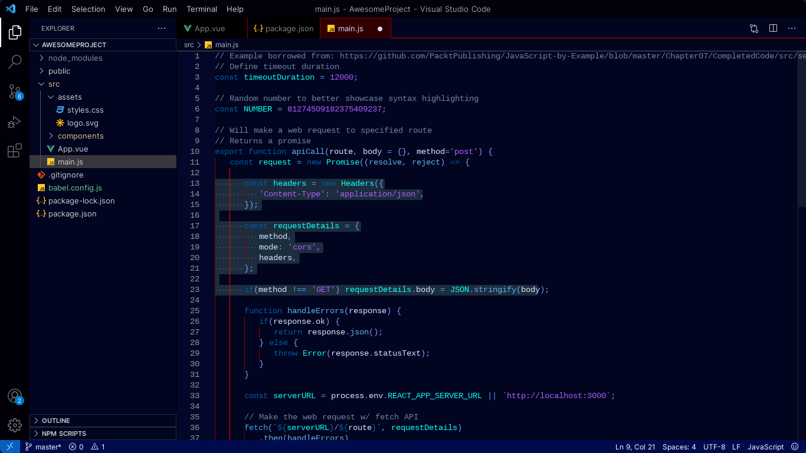

# Scuba-color README

# Scuba Theme for Visual Studio Code

## Dive into the Colors of the Sea

The Scuba theme brings the calming and vibrant colors of the sea to your code editor in Visual Studio Code. With shades reminiscent of ocean blues and tropical aquas, coding becomes a refreshing and delightful experience.

## Support and Appreciation

If you enjoy the Scuba theme and want to express your gratitude, consider supporting us by following us on [Instagram](https://www.instagram.com/asqrb2022/). Your support fuels my motivation to enhance the theme and create more valuable tools for the community.

## Installation

1. Launch Visual Studio Code.
2. Click on the Extensions icon in the Activity Bar on the side or press `Ctrl+Shift+X`.
3. Search for "Scuba" and select "Scuba Theme" by Your Name.
4. Press the "Install" button.
5. Once installed, navigate to `File > Preferences > Color Theme` and choose "Scuba".

## Preview

Experience the soothing colors of the Scuba theme:

## Author

The Scuba theme is crafted with love by [AsqrB](https://github.com/AsqrB). Connect with us on GitHub to stay updated and share your feedback.

©2023 AsqrB
